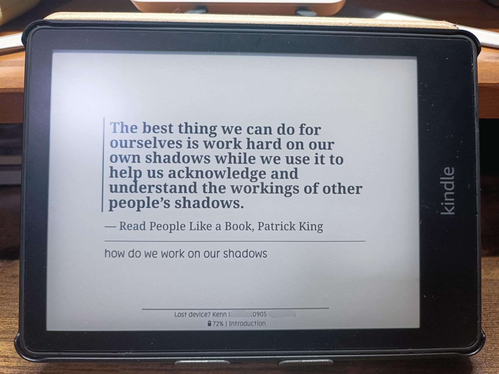
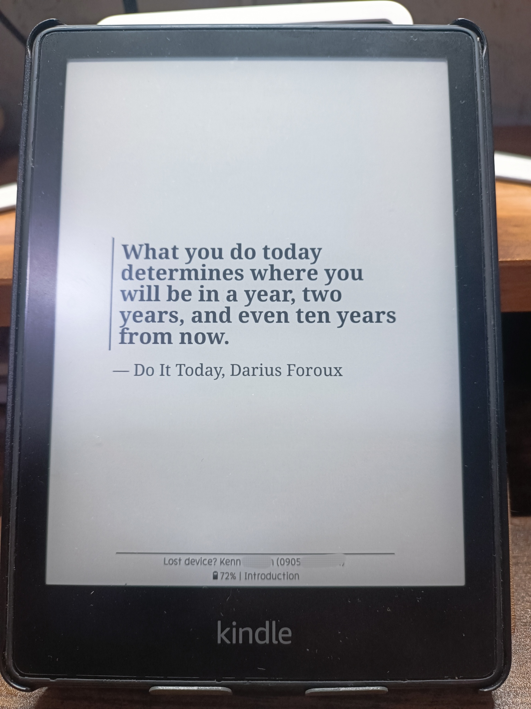
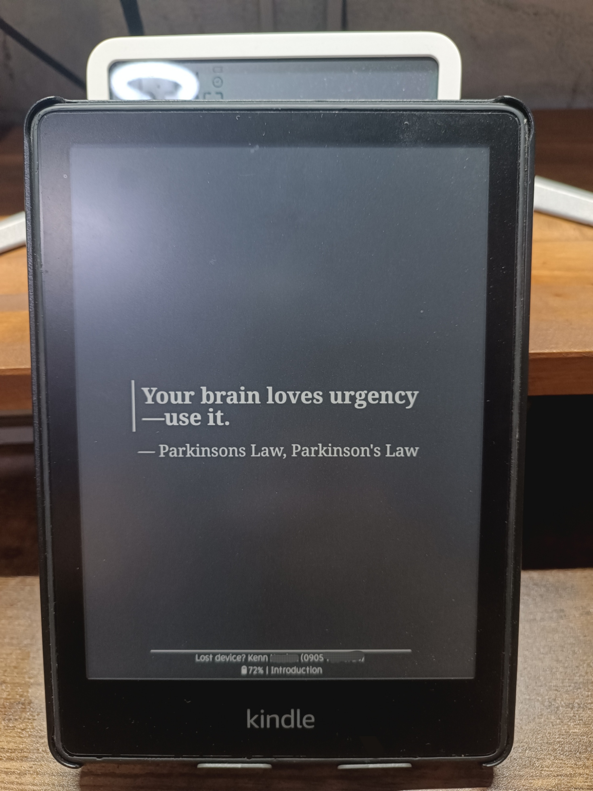

# Highlights Screensaver – Community Fork

Imagine picking up your Kindle or KOReader, and instead of a blank screen, you’re greeted with a quote that inspires, motivates, or heals. That’s the idea behind **Highlights Screensaver**—a plugin that turns your sleep screen into a little frame of wisdom.

Whether you’re:

* Trying to stay productive and avoid procrastination
* Healing and need gentle reminders to reflect
* Studying, working, or building a business
* Simply enjoying the wisdom of your favorite books

…this plugin lets you see **random highlights or personal quotes** right when your device is idle. Think of it as a minimalist, personal reminder board that’s always with you.

**Why you’ll love it:**

* Minimalist design—no clutter, just quotes
* Randomized highlights or imported quotes—keeps inspiration fresh
* Fully customizable—fonts, theme, orientation, and note display
* Import your own quotes—healing quotes, productivity tips, or favorite book lines
* Avoid duplicates—no repeat quotes cluttering your screensaver

I personally use it to show **productivity quotes** to keep me from slacking, and **healing quotes** while reflecting—it’s like having a tiny coach or a gentle nudge right on my sleep screen.

---

## ⚠️ Disclaimer / Community Statement

This repository is a **community-maintained fork** of [Highlights Screensaver](https://github.com/juancoquet/highlights-screensaver) by Juancoquet.

* All functional changes were previously submitted upstream as pull requests.
* Since the original PR has not been merged, this fork is now maintained independently.
* This fork provides additional maintenance, fixes, and new features for the community.

All changes are released under **GNU GPL v3.0**, and users are welcome to use this fork freely.

---

## Example images

| Light Theme Landscape                                                               | Light Theme Portrait                                                               | Dark Theme Portrait                                                            |
| ----------------------------------------------------------------------------------- | ---------------------------------------------------------------------------------- | ------------------------------------------------------------------------------ |
|  |  |  |

---

## Features

* Shows the original quote, source (book & author), and any notes attached to a highlight
* Automatically stays up to date with your latest highlights
* Dynamically resizes text to fit varying content lengths
* Independent font selection for quote, source, and notes
* Theme support: Light, Dark, System (follows device theme)
* Orientation support: Current Book, Portrait, Landscape
* Notes display options: Disable, Full, Short
* Import **external quotes** from text files
* Highlights layout configuration options
* Disable individual highlights to prevent repetition

---

## Installation & Setup

1. Download the latest release archive from the
   [Releases page](https://github.com/k-nacion/highlights-screensaver/releases).
2. Extract the archive.
3. Copy `highlightsscreensaver.koplugin` into `koreader/plugins/` on your device.
4. Restart KOReader.

> The release archive name may change between versions.
> Always extract and copy the `highlightsscreensaver.koplugin` folder.

### Initial Setup

1. Open `Settings → Screen → Sleep screen → Wallpaper`
2. Select **“Show highlights screensaver”**

### Configure Scannable Directories

1. Navigate to your library folder
2. Open `Screen → Sleep screen → Highlights screensaver → Content`
3. Select **“Add current directory to scannable directories”**

> Subdirectories are scanned automatically.

### Scan Book Highlights

1. Go to `Screen → Sleep screen → Highlights screensaver → Content`
2. Select **“Scan book highlights”**

Automatic scanning occurs once per day.
A manual scan can be triggered at any time.

---

## Customize Appearance & Behavior

* Change fonts

* Set theme mode (Light, Dark, System)

* Choose orientation (Current Book, Portrait, Landscape)

* Configure notes display:

    * Disable
    * Full
    * Short (with character limit)

* Adjust highlights layout configuration

All options are available under:
`Screen → Sleep screen → Highlights screensaver`

---

## Adding External Quotes

### How It Works

1. Create a directory for your quote files.
2. Add one or more `*.txt` files—each file represents a collection of quotes.
3. Make sure all quote files are in the **same folder**.

### File Format

* Each quote is separated by `======`.
* Use `~` to indicate the author or source (optional).

```txt
======
Life is what happens when you're busy making other plans.
~ John Lennon
======
Happiness comes from your own actions.
~ Dalai Lama
```

> ⚠️ The `~` author/source is optional. If omitted, the quote will still be imported.

### Importing Quotes

1. Navigate to:
   `Screen → Sleep Screen → Highlights Screensaver → Content → Import External Quote`
2. Select the folder containing your quote files.

> ⚠️ Note: This feature is fully functional but still being refined in future updates.

---

## Roadmap / Planned Features

* [ ] **Manage scannable directories** – view, remove, edit
* [ ] **Pause / pin a highlight** – display favorite quotes persistently
* [x] **Skip duplicates when importing** – avoid repeated quotes
* [ ] **Highlight / quote sequencing** – Shuffle or Sequential display
* [x] **Screensaver message menu** – dynamic control of message content, layout, and placement

---

## Compatibility

### Tested Devices

* **Kobo** – KOReader 2025.10
* **Linux Mint** – KOReader nightly build
* **Kindle Paperwhite 5** – KOReader 2025.10

Other devices may work.
Testing, bug reports, and contributions are welcome.

---

## Credits

* SHA1 file from [Egor Skriptunoff / pure_lua_SHA](https://github.com/Egor-Skriptunoff/pure_lua_SHA/blob/master/sha2.lua)

    * Used to generate hash values for external quotes to avoid duplication

---

⭐ If you enjoy Highlights Screensaver, please consider leaving a star.
